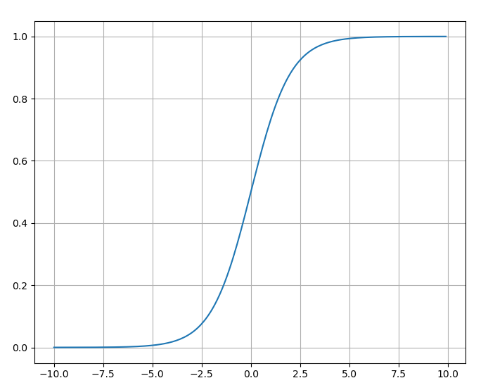
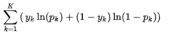
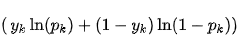
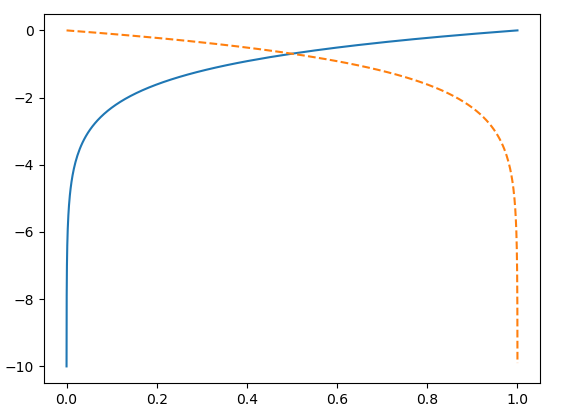

# Regressione-Logistica
La regressione logistica è un modello probabilistico impiegato per la risoluzione di problemi di classificazione lineari e binari , la variabile target , dunque , è una variabile dicotomica , cioè assume solo i valori 0 e 1. Nella pratica non si è solamente interessati a predire l'etichetta delle classi , ma si vuole in qualche modo determinare la probabilità di appartenenza. Quindi non solo vogliamo stabilire a che classe appartiene un determinato esempio, ma siamo anche interessati a stimarne una probabilità di appartenenza.

La regressione logistica , come modello probabilistico , si fonda sul concetto di probabilità di appartenenza di un esempio ad una determinata classe
<p align='center'>
P{(y=1|x)} = p(x)
</br></br>
P({y=0|x)} = 1 - p(x)
</p>

le probabilità sono grandezze varianti sull'intervallo [0,1] , quindi di fatto , non è possibile utilizzare un modello lineare per mettere in relazione il vettore delle caratteristiche x , con le probabilità di successo , perchè l'uscita di un generico modello lineare del tipo
<p align='center'>
  y = mx + q
<p>
                                                                    
è sui reali. Al fine di esprimere una relazione lineare tra le caratteristiche e le probabilità , è necessario che p(x) sia l'argomento di una funzione che mappi l'intervallo [0,1] sui reali. La funzione maggiormente utilizzata è la funzione logit , definita come 
<p align='center'>
                                                     log (p(x)/(1-p(x)) 
</p>                                            
definita sull'intervallo [0,1] e invertibile. Quindi volendo esprimere una relazione lineare tra il vettore delle caratteristiche e i log-odds

<p align = 'center'>
    </br>log (p(x)/(1-p(x))  = bx
</p>

(si è messo nel vettore dei coefficienti il bias unit) , ma essendo interessati a determinare le probabilità di appartenenza , la funzione inversa è ben definita è vale

<p align = 'center'>
                                           p(x) = exp(bx)/(1+exp(bx)) = 1/(1+exp(-bx))
</p>          

nota in letteratura come funzione sigmoide , per via della sua forma ad S.

Scriviamo un semplice codice python per visualizzarla a schermo

```bash
import matplotlib.pyplot as plt
import numpy as np

# funzione sigmoide
def sigmoideFunction(x):
    return 1.0 / (1.0 + np.exp(-x))

# main
if __name__ == '__main__':
    x = np.arange(-10,10,0.1)
    y = sigmoideFunction(x)
    # plotting
    plt.figure(1)
    plt.plot(x,y)
    plt.grid()
    plt.show()
```
<p align='center'>
   
</p>

Come notiamo questa funzione prende in input delle combinazioni lineari delle caratteristiche (input della rete) e li mappa in valori compresi sull'intervallo [0,1] , interpretabili come la probabilità che il generico esempio con caratteristiche x appartenga alla classe y = 1.In phearticolare si noti che la funzione vale 0.5 , quando l'input della rete è zero. 

A questo punto possiamo impiegare una semplice funzione gradino (Heaviside) per convertire il valore di probabilità in un valore binario

       if (sigmoide(x) >= 0.5) 
           y = 1
       else 
           y = 0

Per determinare il vettore dei besi b , si utilizza un semplice stimatore a massima verosimiglianza. Ipotizzando l'indipendenza tra i campioni di addestramento , il funzionale (verosimiglianza) che si intende massimizzare

<p align='center'>
   
</p>

ovviamente basta moltiplicarlo per -1 per passare ad un problema di minimizzazione. Ma facciamo un attimo una piccola analisi sullo i-esimo termine della sommatoria

<p align='center'>
   
</p>

notiamo che vale log(sigmodide(x)) quando y_i = 1 altrimenti log(1-sigmoide(x)).Di seguito è riportato il codice per il tracciamento del funzionale di costo nei due casi

```bash
# funzionale di costo y_i = 1
def costoPrimo(x):
    return np.log(sigmoideFunction(x))

# funzionale di costo y_i = 0
def costoSecondo(x):
    return np.log(1 - sigmoideFunction(x))

# main
if __name__ == '__main__':
    x  = np.arange(-10,10,0.1)
    c1 = costoPrimo(x)
    c2 = costoSecondo(x)
    t  = sigmoideFunction(x)
    plt.figure(1)
    plt.plot(t,c1,label='y=1')
    plt.plot(t,c2,linestyle='--',label='y=0')
    plt.show()
```
passiamo ora a graficare il risultato per camirne meglio il comportamento dei singoli contributi.

<p align='center'>
  
</p>

notiamo che nei rispettivi casi il costo è massimo se prediciamo correttamente l'appartenenza dell'esempio alla classe corrispondente. Al contrario se la predizione è errata il costo va a meno infinito.Le predizioni errate vengono dunque pesate con un costo sempre maggiore.
